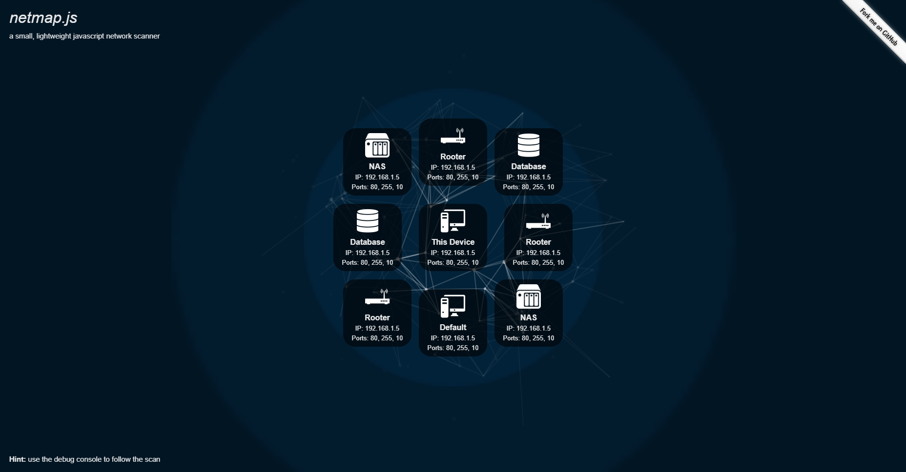

# netmap.js

A small lightweight network scanner, written in javascript.
netmap.js is an open source penetration testing tool, written in javascript. It tries to scan the local network for open port in different ip ranges and make guesses on the type of device, based on the list of open ports.

Demo
----



Can be found [here](demo/).

Installation
----

You can download the source files or the compiled file by clicking [here](https://github.com/PatriceKast/netmap.js/tarball/master).

Preferably, you can download netmap.js by cloning the [Git](https://github.com/PatriceKast/netmap.js) repository:

    git clone --depth 1 https://github.com/PatriceKast/netmap.js.git sqlmap-dev

Usage
----

To use this js plugin, create a new netmap.js object:

	const netmap = new Netmap();

The following functions are avaible:

	netmap.addLocalRange()

	netmap.scanDevice(ip, light)      // Starts a portscan on a given ip, if light=true only some highly common used ports are tested
	netmap.scanGateways(ligt)         // Starts a portscan on all possible gateways, if light=true only some highly common used ports are tested
	netmap.scanRange(range, light)    // Starts a portscan on a given ip range, if light=true only some highly common used ports are tested
	netmap.scanNetwork()              // Autoscan of the full network

The following values are avaible:
	
	netmap.scannedIps     // List of scanned IPs
	netmap.devices        // List of found devices
	netmap.gateways       // List of scannable gateways
	netmap.ranges         // List of scannable ranges

	netmap.eventEmitter   // EventEmitter of netmap.js

The EventEmitter fires on the following signals:

	netmap.eventEmitter.on("scan-port:start", ({ ip, port }) => {});
	netmap.eventEmitter.on("scan-port:end", ({ ip, port, open }) => {});

	netmap.eventEmitter.on("scan-device:start", ({ ip }) => {});
	netmap.eventEmitter.on("scan-device:end", ({ ip, duration, ports, portsPerSecond }) => {});

	netmap.eventEmitter.on("scan-gateways:start", () => {});
	netmap.eventEmitter.on("scan-gateways:end", () => {});

	netmap.eventEmitter.on("scan-range:start", ({ range, light }) => {});
	netmap.eventEmitter.on("scan-range:end", ({ range }) => {});
	netmap.eventEmitter.on("add-local-range", ({ range, ip }) => {});

The Device class has the following values:

	const device = new Device();

	device.ip // Get IP of this device
	device.ports // Get a Set of reachable Ports
	device.type // DeviceType of this Device

The following DeviceType can be detected:

```json
{
    "DEFAULT": { "name": "Default", "ports": [] },
    "ROUTER": { "name": "Router", "ipsuffix": "1", "ports": [80, 443] },
	"SYNOLOGY_NAS": { "name": "Synology NAS", "ports": [5000, 5001] },
	"DATABASE": { "name": "Database", "ports": [3306] },
	"MAIL": { "name": "Mail Server", "ports": [25, 110, 143, 465, 587, 993, 995] },
	"LDAP": { "name": "LDAP Server", "ports": [389, 636] },
	"KERBEROS": { "name": "Kerberos Server", "ports": [88, 464, 543, 544, 749, 750, 751, 752, 753, 754, 760, 1109, 2053, 2105] },
	"AD": { "name": "Active Directory", "ports": [445] }
}
```

Compatiblity
----

The netmap.js plugin is compatible with the following browsers: